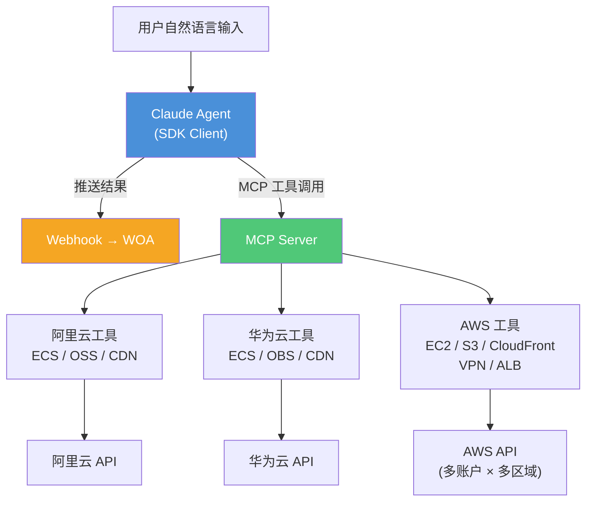

# 多云治理监控助手

基于 **Claude Agents SDK** 构建的多云治理工具，通过自然语言统一查询阿里云、华为云、AWS 三大平台的云主机、对象存储、CDN 资源状态，自动发现闲置资源并给出优化建议。

## 核心能力

- **三云统一治理** — 一条自然语言同时查询阿里云 / 华为云 / AWS，输出格式一致，便于横向对比
- **三大资源聚焦** — 云主机（ECS/EC2）、对象存储（OSS/OBS/S3）、CDN（CDN/CloudFront）
- **闲置资源检测** — 自动识别已停止实例、禁用 CDN、低 CPU 利用率主机
- **AWS 多账户多区域** — 支持多账户配置，EC2 等服务自动遍历多区域
- **AWS 网络 & 负载** — VPN 隧道状态 + 流量监控、ALB 健康度监控
- **Webhook 推送** — 查询结果自动推送到金山文档、企业微信等

## 架构



## 快速开始

### 1. 安装依赖

```bash
pip install -r requirements.txt
```

> 需要 Python 3.10+

### 2. 配置云平台凭证

```bash
cp config.yaml.example config.yaml
```

#### 阿里云

```yaml
aliyun:
  enabled: true
  access_key_id: "your-access-key-id"
  access_key_secret: "your-access-key-secret"
  region_id: "cn-hangzhou"
```

#### 华为云

```yaml
huawei:
  enabled: true
  ak: "your-access-key"
  sk: "your-secret-key"
  project_id: "your-project-id"
  region: "cn-north-4"
```

#### AWS 单账户

```yaml
aws:
  enabled: true
  access_key_id: "your-ak"
  secret_access_key: "your-sk"
  region: "us-east-2"
  regions: ["us-east-2", "us-west-2", "ap-southeast-1"]
  vpn_region: "ap-southeast-1"
  elb_region: "us-west-2"
```

#### AWS 多账户

```yaml
aws:
  enabled: true
  accounts:
    - name: "production"
      access_key_id: "prod-ak"
      secret_access_key: "prod-sk"
      region: "us-east-2"
      regions: ["us-east-2", "us-west-2", "ap-southeast-1"]
      vpn_region: "ap-southeast-1"
      elb_region: "us-west-2"
    - name: "staging"
      access_key_id: "staging-ak"
      secret_access_key: "staging-sk"
      region: "us-east-1"
```

#### Webhook 推送

```yaml
webhook:
  enabled: true
  url: "https://your-webhook-url"
```

### 3. 运行

```bash
# 交互式模式（推荐）
python main.py

# 单次查询
python main.py -q "查看所有云平台的云主机状态"

# 指定配置文件
python main.py -c /path/to/config.yaml
```

## 查询示例

### 多云统一查询

```
查看所有云平台的云主机                → 三朵云 ECS/EC2 概览 + 停机详情
查看所有云平台的对象存储              → OSS/OBS/S3 存储桶 + 区域分布
查看所有云平台的 CDN 状态             → CDN/CloudFront 概览 + 禁用详情
```

### 阿里云

```
查看阿里云 ECS 实例                   → 概览 + 已停止实例详情
查看阿里云 OSS 存储桶                 → 存储桶列表 + 区域分布
查看阿里云 CDN 域名                   → 概览 + 已停用域名详情
```

### 华为云

```
查看华为云 ECS 实例                   → 概览 + 已停止实例详情
查看华为云 OBS 存储桶                 → 存储桶列表 + 区域分布
查看华为云 CDN 域名                   → 概览 + 已停用域名详情
```

### AWS

```
查看 EC2 实例列表                     → 多区域概览 + 已停止实例详情
检测所有闲置 EC2                      → 已停止 + CPU<5% 实例详情
查看 S3 存储桶列表                    → 全部桶 + 区域分布
查看 CloudFront CDN 分发              → 概览 + 禁用分发详情
查看 VPN 隧道状态和流量               → UP/DOWN + 速率(Mb/s)
查看 ALB 负载均衡器                   → ALB 实例列表
```

## 工具清单

### 阿里云

| 工具 | 功能 |
|------|------|
| `aliyun_list_ecs` | ECS 实例概览 + 已停止实例详情 |
| `aliyun_list_oss` | OSS 存储桶列表（含区域分布） |
| `aliyun_list_cdn` | CDN 域名概览 + 已停用域名详情 |
| `aliyun_list_metrics` | ECS 可用监控指标 |
| `aliyun_get_metric_data` | 查询 ECS 指标数据 |

### 华为云

| 工具 | 功能 |
|------|------|
| `huawei_list_ecs` | ECS 实例概览 + 已停止实例详情 |
| `huawei_list_obs` | OBS 存储桶列表（含区域分布） |
| `huawei_list_cdn` | CDN 域名概览 + 已停用域名详情 |
| `huawei_list_metrics` | ECS 可用监控指标 |
| `huawei_get_metric_data` | 查询 ECS 指标数据 |

### AWS

| 工具 | 功能 | 多账户 | 多区域 |
|------|------|:------:|:------:|
| `aws_list_accounts` | 已配置的账户和区域信息 | - | - |
| `aws_list_ec2` | EC2 概览 + 已停止实例详情 | ✅ | ✅ |
| `aws_idle_ec2` | 闲置检测：已停止 + CPU<5% | ✅ | ✅ |
| `aws_list_s3` | S3 存储桶列表（含区域分布） | ✅ | ✅ 过滤 |
| `aws_list_cloudfront` | CloudFront 概览 + 禁用详情 | ✅ | 全局 |
| `aws_list_vpn` | VPN 连接与隧道状态 | ✅ | vpn_region |
| `aws_vpn_status` | VPN 流量速率(Mb/s) + 趋势 | ✅ | vpn_region |
| `aws_list_elb` | ALB 负载均衡器列表 | ✅ | elb_region |
| `aws_list_metrics` | CloudWatch 可用指标 | ✅ | 按服务 |
| `aws_get_metric_data` | CloudWatch 指标数据 | ✅ | 按服务 |

## 输出特性

### 治理导向的统一格式

三朵云的同类资源输出格式保持一致：

- **云主机**（ECS/EC2）：概览统计（总数、运行中、已停止）+ 仅输出已停止实例的完整详情
- **对象存储**（OSS/OBS/S3）：存储桶列表 + 区域分布统计
- **CDN**（CDN/CloudFront）：概览统计（总数、在线、离线）+ 仅输出已停用/禁用分发的完整详情

### AWS 增强

- **EC2 闲置检测**：自动识别已停止实例 + CPU 利用率 < 5% 的运行实例
- **VPN 监控**：隧道状态 UP/DOWN、总流量、平均/峰值速率(Mb/s)、趋势分析
- **CloudFront**：禁用分发含详细信息（证书、WAF、价格等级等）

### Webhook 推送

查询结果自动推送到 Webhook URL（金山文档 WOA、企业微信等）：

```json
{
  "msgtype": "text",
  "text": { "content": "查询结果..." }
}
```

## 项目结构

```
monitor/
├── main.py                          # 主入口（交互 / 单次查询）
├── config.yaml.example              # 配置示例
├── requirements.txt                 # Python 依赖
├── README.md                        # 中文文档
├── README_EN.md                     # English documentation
└── cloud_monitor/
    ├── __init__.py
    ├── agent.py                     # Claude Agent（工具注册 / 系统提示词）
    ├── config.py                    # 配置管理（多云 / 多账户）
    ├── webhook.py                   # Webhook 推送
    ├── models/
    │   ├── __init__.py
    │   └── metrics.py               # 统一数据模型
    └── tools/
        ├── __init__.py
        ├── aliyun.py                # 阿里云（ECS / OSS / CDN）
        ├── huawei.py                # 华为云（ECS / OBS / CDN）
        └── aws.py                   # AWS（EC2 / S3 / CloudFront / VPN / ALB）
```

## 技术栈

| 组件 | 技术 |
|------|------|
| AI Agent | Claude Agents SDK + MCP |
| 阿里云 | `alibabacloud-ecs20140526` / `oss2` / `alibabacloud-cdn20180510` / `alibabacloud-cms20190101` |
| 华为云 | `huaweicloudsdkecs` / `esdk-obs-python` / `huaweicloudsdkcdn` / `huaweicloudsdkces` |
| AWS | `boto3` (EC2 / S3 / CloudFront / CloudWatch / ELBv2 / VPN) |
| 终端输出 | Rich |
| 配置管理 | PyYAML |
