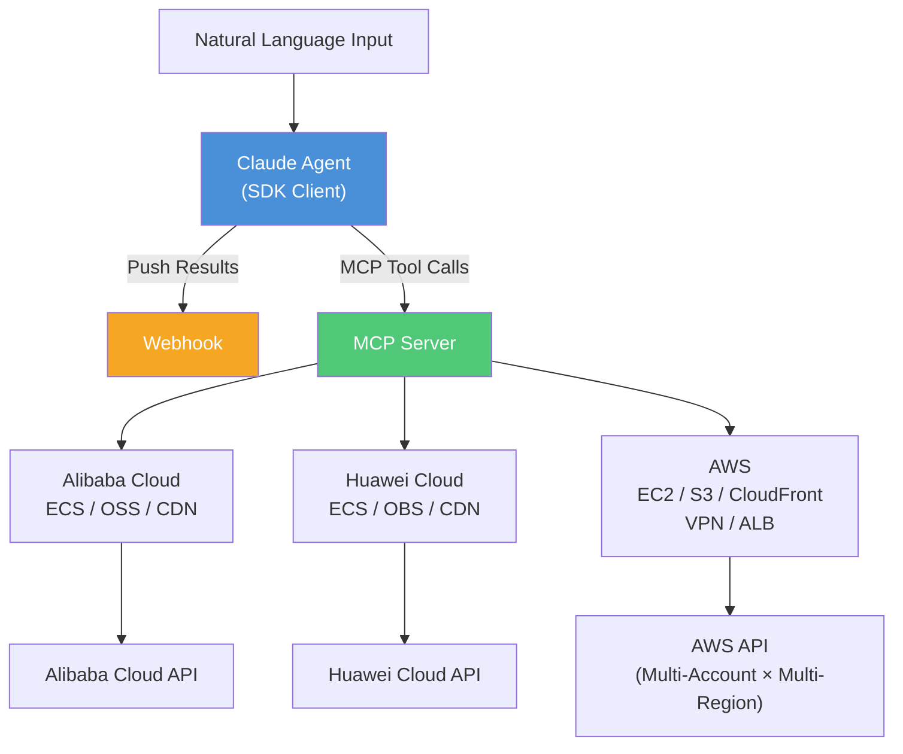

# Multi-Cloud Governance Monitor

A multi-cloud governance tool built on the **Claude Agents SDK**. Query Alibaba Cloud, Huawei Cloud, and AWS resources using natural language — detect idle resources and get optimization recommendations automatically.

## Key Features

- **Unified Multi-Cloud** — Single natural language query across Alibaba Cloud / Huawei Cloud / AWS with consistent output format
- **Three Core Resources** — Compute (ECS/EC2), Object Storage (OSS/OBS/S3), CDN (CDN/CloudFront)
- **Idle Resource Detection** — Auto-detect stopped instances, disabled CDN domains, low-CPU hosts
- **AWS Multi-Account & Multi-Region** — Multiple accounts with per-account multi-region traversal for EC2
- **AWS Network & Load Balancing** — VPN tunnel status + traffic monitoring, ALB health monitoring
- **Webhook Integration** — Push results to KDocs, WeCom, Slack, etc.

## Architecture



## Quick Start

### 1. Install Dependencies

```bash
pip install -r requirements.txt
```

> Requires Python 3.10+

### 2. Configure Cloud Credentials

```bash
cp config.yaml.example config.yaml
```

#### Alibaba Cloud

```yaml
aliyun:
  enabled: true
  access_key_id: "your-access-key-id"
  access_key_secret: "your-access-key-secret"
  region_id: "cn-hangzhou"
```

#### Huawei Cloud

```yaml
huawei:
  enabled: true
  ak: "your-access-key"
  sk: "your-secret-key"
  project_id: "your-project-id"
  region: "cn-north-4"
```

#### AWS (Single Account)

```yaml
aws:
  enabled: true
  access_key_id: "your-ak"
  secret_access_key: "your-sk"
  region: "us-east-2"
  regions: ["us-east-2", "us-west-2", "ap-southeast-1"]
  vpn_region: "ap-southeast-1"
  elb_region: "us-west-2"
```

#### AWS (Multi-Account)

```yaml
aws:
  enabled: true
  accounts:
    - name: "production"
      access_key_id: "prod-ak"
      secret_access_key: "prod-sk"
      region: "us-east-2"
      regions: ["us-east-2", "us-west-2", "ap-southeast-1"]
      vpn_region: "ap-southeast-1"
      elb_region: "us-west-2"
    - name: "staging"
      access_key_id: "staging-ak"
      secret_access_key: "staging-sk"
      region: "us-east-1"
```

#### Webhook

```yaml
webhook:
  enabled: true
  url: "https://your-webhook-url"
```

### 3. Run

```bash
# Interactive mode (recommended)
python main.py

# Single query
python main.py -q "Show all cloud VMs status"

# Custom config file
python main.py -c /path/to/config.yaml
```

## Query Examples

### Cross-Cloud

```
Show all cloud VMs                    → ECS/EC2 overview + stopped details for all clouds
Show all object storage buckets       → OSS/OBS/S3 buckets + region distribution
Show all CDN status                   → CDN/CloudFront overview + disabled details
```

### Alibaba Cloud

```
Show Alibaba Cloud ECS instances      → Overview + stopped instance details
Show Alibaba Cloud OSS buckets        → Bucket list + region distribution
Show Alibaba Cloud CDN domains        → Overview + offline domain details
```

### Huawei Cloud

```
Show Huawei Cloud ECS instances       → Overview + stopped instance details
Show Huawei Cloud OBS buckets         → Bucket list + region distribution
Show Huawei Cloud CDN domains         → Overview + offline domain details
```

### AWS

```
Show EC2 instances                    → Multi-region overview + stopped details
Detect idle EC2 instances             → Stopped + CPU<5% instance details
Show S3 buckets                       → All buckets + region distribution
Show CloudFront distributions         → Overview + disabled distribution details
Show VPN tunnel status and traffic    → UP/DOWN + rate (Mb/s)
Show ALB load balancers               → ALB instance list
```

## Tool Reference

### Alibaba Cloud

| Tool | Description |
|------|-------------|
| `aliyun_list_ecs` | ECS overview + stopped instance details |
| `aliyun_list_oss` | OSS bucket list with region distribution |
| `aliyun_list_cdn` | CDN domain overview + offline domain details |
| `aliyun_list_metrics` | Available ECS monitoring metrics |
| `aliyun_get_metric_data` | Query ECS metric data |

### Huawei Cloud

| Tool | Description |
|------|-------------|
| `huawei_list_ecs` | ECS overview + stopped instance details |
| `huawei_list_obs` | OBS bucket list with region distribution |
| `huawei_list_cdn` | CDN domain overview + offline domain details |
| `huawei_list_metrics` | Available ECS monitoring metrics |
| `huawei_get_metric_data` | Query ECS metric data |

### AWS

| Tool | Description | Multi-Account | Multi-Region |
|------|-------------|:-------------:|:------------:|
| `aws_list_accounts` | Configured accounts & regions | - | - |
| `aws_list_ec2` | EC2 overview + stopped details | ✅ | ✅ |
| `aws_idle_ec2` | Idle detection: stopped + CPU<5% | ✅ | ✅ |
| `aws_list_s3` | S3 buckets with region distribution | ✅ | ✅ filter |
| `aws_list_cloudfront` | CloudFront overview + disabled details | ✅ | Global |
| `aws_list_vpn` | VPN connections & tunnel status | ✅ | vpn_region |
| `aws_vpn_status` | VPN traffic rate (Mb/s) + trends | ✅ | vpn_region |
| `aws_list_elb` | ALB load balancer list | ✅ | elb_region |
| `aws_list_metrics` | CloudWatch available metrics | ✅ | Per service |
| `aws_get_metric_data` | CloudWatch metric data | ✅ | Per service |

## Output Design

### Governance-Oriented Unified Format

All three clouds output the same format for equivalent resources:

- **Compute** (ECS/EC2): Summary stats (total, running, stopped) + full details only for stopped instances
- **Object Storage** (OSS/OBS/S3): Bucket list + region distribution summary
- **CDN** (CDN/CloudFront): Summary stats (total, online, offline) + full details only for disabled/offline distributions

### AWS Enhancements

- **EC2 Idle Detection**: Stopped instances + running instances with CPU < 5%
- **VPN Monitoring**: Tunnel UP/DOWN status, total traffic, average/peak rate (Mb/s), trend analysis
- **CloudFront**: Disabled distributions include certificate, WAF, price class details

### Webhook

Results are automatically pushed to configured webhook URLs (KDocs WOA, WeCom, etc.):

```json
{
  "msgtype": "text",
  "text": { "content": "Query results..." }
}
```

## Project Structure

```
monitor/
├── main.py                          # Entry point (interactive / single query)
├── config.yaml.example              # Configuration example
├── requirements.txt                 # Python dependencies
├── README.md                        # Chinese documentation
├── README_EN.md                     # English documentation
└── cloud_monitor/
    ├── __init__.py
    ├── agent.py                     # Claude Agent (tool registration / system prompt)
    ├── config.py                    # Config management (multi-cloud / multi-account)
    ├── webhook.py                   # Webhook integration
    ├── models/
    │   ├── __init__.py
    │   └── metrics.py               # Unified data models
    └── tools/
        ├── __init__.py
        ├── aliyun.py                # Alibaba Cloud (ECS / OSS / CDN)
        ├── huawei.py                # Huawei Cloud (ECS / OBS / CDN)
        └── aws.py                   # AWS (EC2 / S3 / CloudFront / VPN / ALB)
```

## Tech Stack

| Component | Technology |
|-----------|-----------|
| AI Agent | Claude Agents SDK + MCP |
| Alibaba Cloud | `alibabacloud-ecs20140526` / `oss2` / `alibabacloud-cdn20180510` / `alibabacloud-cms20190101` |
| Huawei Cloud | `huaweicloudsdkecs` / `esdk-obs-python` / `huaweicloudsdkcdn` / `huaweicloudsdkces` |
| AWS | `boto3` (EC2 / S3 / CloudFront / CloudWatch / ELBv2 / VPN) |
| Terminal UI | Rich |
| Configuration | PyYAML |
